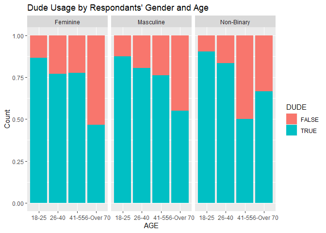
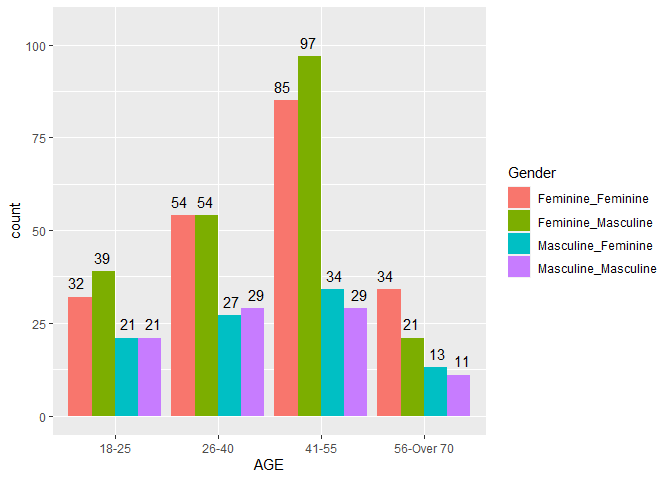

Address Term 2023
================
Soobin Choi
2023-05-01

- <a href="#data-processing" id="toc-data-processing">Data Processing</a>
- <a href="#analysis--plots" id="toc-analysis--plots">Analysis &amp;
  Plots</a>
  - <a href="#the-usage-of-dude-by-gender-and-age"
    id="toc-the-usage-of-dude-by-gender-and-age">The usage of <em>DUDE</em>
    by gender and age</a>
  - <a href="#use-of-dude-by-gender-of-speaker-and-addressee-2023"
    id="toc-use-of-dude-by-gender-of-speaker-and-addressee-2023">Use of dude
    by Gender of Speaker and Addressee (2023)</a>
  - <a href="#the-usage-of-dude-and-bro-by-gender---non-binary-exclusive"
    id="toc-the-usage-of-dude-and-bro-by-gender---non-binary-exclusive">The
    usage of <em>dude</em> and <em>bro</em> by gender - non-binary
    exclusive</a>
  - <a href="#is-there-any-difference-in-the-usage-of-dude-by-race"
    id="toc-is-there-any-difference-in-the-usage-of-dude-by-race">Is there
    any difference in the usage of <em>dude</em> by race?</a>

``` r
knitr::opts_chunk$set(echo=TRUE, include=TRUE, comment="")
library(tidyverse)
library(dplyr)
library(ggplot2)
```

# Data Processing

``` r
original <- read_csv("data/original_full.csv")
```

    Rows: 4580 Columns: 18
    ── Column specification ────────────────────────────────────────────────────────
    Delimiter: ","
    chr (10): ResponseId, AT-EVER-USE, RESP-GENDER, GENDER-4-TEXT, SEXUALITY, AG...
    dbl  (8): LANGUAGE, PARENTS, SIBLING, PARTNER, COWORKER, BOSS, FRIEND, STRANGER

    ℹ Use `spec()` to retrieve the full column specification for this data.
    ℹ Specify the column types or set `show_col_types = FALSE` to quiet this message.

``` r
rank_sent <- read_csv("data/rank_sent.csv")
```

    Rows: 458 Columns: 31
    ── Column specification ────────────────────────────────────────────────────────
    Delimiter: ","
    chr  (7): ResponseId, AT ever use, RESP-GENDER, GENDER-4-TEXT, SEXUALITY, AG...
    dbl (24): MUSIC-BRO, MUSIC-GIRL, MUSIC-DUDE, MUSIC-BRUH, MEETING-BRO, MEETIN...

    ℹ Use `spec()` to retrieve the full column specification for this data.
    ℹ Specify the column types or set `show_col_types = FALSE` to quiet this message.

``` r
brobruh <- read_csv("data/brobruh.csv")
```

    Rows: 458 Columns: 7
    ── Column specification ────────────────────────────────────────────────────────
    Delimiter: ","
    chr (7): ResponseId, AT ever use, RESP-GENDER, GENDER-4-TEXT, SEXUALITY, AGE...

    ℹ Use `spec()` to retrieve the full column specification for this data.
    ℹ Specify the column types or set `show_col_types = FALSE` to quiet this message.

``` r
head(original)
```

    # A tibble: 6 × 18
      ResponseId AT-EV…¹ RESP-…² GENDE…³ SEXUA…⁴ AGE   LANGU…⁵ RACE  OCCUP…⁶ ADDR-…⁷
      <chr>      <chr>   <chr>   <chr>   <chr>   <chr>   <dbl> <chr> <chr>   <chr>  
    1 R_9FRUk95… dude,m… Non-bi… <NA>    Gay     18-25       1 White Editor… FEMINI…
    2 R_25EnKuX… dude,g… Femini… <NA>    Hetero  26-40       1 white Studen… FEMINI…
    3 R_2pLWRKV… bro,du… Femini… <NA>    Bisexu… 26-40       1 White PhD st… FEMINI…
    4 R_PBtJhKN… bro,du… Mascul… <NA>    Straig… 26-40       1 White Teacher FEMINI…
    5 R_22wZhXw… dude,m… Mascul… <NA>    Straig… 41-55       1 White Civil … FEMINI…
    6 R_305B45b… bro,du… Femini… <NA>    Bisexu… 18-25       1 White Econom… FEMINI…
    # … with 8 more variables: TERM <chr>, PARENTS <dbl>, SIBLING <dbl>,
    #   PARTNER <dbl>, COWORKER <dbl>, BOSS <dbl>, FRIEND <dbl>, STRANGER <dbl>,
    #   and abbreviated variable names ¹​`AT-EVER-USE`, ²​`RESP-GENDER`,
    #   ³​`GENDER-4-TEXT`, ⁴​SEXUALITY, ⁵​LANGUAGE, ⁶​OCCUPATION, ⁷​`ADDR-GENDER`

``` r
head(rank_sent)
```

    # A tibble: 6 × 31
      Respon…¹ AT ev…² RESP-…³ GENDE…⁴ SEXUA…⁵ AGE   MUSIC…⁶ MUSIC…⁷ MUSIC…⁸ MUSIC…⁹
      <chr>    <chr>   <chr>   <chr>   <chr>   <chr>   <dbl>   <dbl>   <dbl>   <dbl>
    1 R_9FRUk… dude,m… Non-bi… <NA>    Gay     18-25       2       4       1       3
    2 R_25EnK… dude,g… Femini… <NA>    Hetero  26-40       3       2       1       4
    3 R_2pLWR… bro,du… Femini… <NA>    Bisexu… 26-40       3       2       1       4
    4 R_PBtJh… bro,du… Mascul… <NA>    Straig… 26-40       2       3       1       4
    5 R_22wZh… dude,m… Mascul… <NA>    Straig… 41-55       2       3       1       4
    6 R_305B4… bro,du… Femini… <NA>    Bisexu… 18-25       3       2       1       4
    # … with 21 more variables: `MEETING-BRO` <dbl>, `MEETING-GIRL` <dbl>,
    #   `MEETING-DUDE` <dbl>, `MEETING-BRUH` <dbl>, `SHUTUP-BRO` <dbl>,
    #   `SHUTUP-GIRL` <dbl>, `SHUTUP-DUDE` <dbl>, `SHUTUP-BRUH` <dbl>,
    #   `GOODTOSEE-BRO` <dbl>, `GOODTOSEE-GIRL` <dbl>, `GOODTOSEE-DUDE` <dbl>,
    #   `GOODTOSEE-BRUH` <dbl>, `SIGNAL-BRO` <dbl>, `SIGNAL-GIRL` <dbl>,
    #   `SIGNAL-DUDE` <dbl>, `SIGNAL-BRUH` <dbl>, `EMAIL-BRO` <dbl>,
    #   `EMAIL-GIRL` <dbl>, `EMAIL-DUDE` <dbl>, `EMAIL-BRUH` <dbl>, Q23 <chr>, …

``` r
head(brobruh)
```

    # A tibble: 6 × 7
      ResponseId        `AT ever use`     `RESP-GENDER` GENDER…¹ SEXUA…² AGE   Q23  
      <chr>             <chr>             <chr>         <chr>    <chr>   <chr> <chr>
    1 R_9FRUk95l1fWKDZf dude,man          Non-binary    <NA>     Gay     18-25 <NA> 
    2 R_25EnKuXyTReLPE2 dude,girl,man     Feminine      <NA>     Hetero  26-40 Depe…
    3 R_2pLWRKVYVALdO6e bro,dude,girl,man Feminine      <NA>     Bisexu… 26-40 Bruh…
    4 R_PBtJhKNv0JB10GJ bro,dude,man      Masculine     <NA>     Straig… 26-40 Bruh…
    5 R_22wZhXw6DTa6krK dude,man          Masculine     <NA>     Straig… 41-55 <NA> 
    6 R_305B45bvuFeKZUx bro,dude,girl,man Feminine      <NA>     Bisexu… 18-25 I do…
    # … with abbreviated variable names ¹​`GENDER-4-TEXT`, ²​SEXUALITY

``` r
# remove NAs in AT-EVER-USE and AGE column
original1 <- original %>% 
  rename(`RESP-ID` = ResponseId) %>% 
  rename(ATUSE = `AT-EVER-USE`) %>% 
  filter(!is.na(ATUSE) & !is.na(AGE))

# remove 'other' genders and move columns for better looking
original2 <- original1 %>% 
  mutate(`RESP-GENDER` = str_to_title(`RESP-GENDER`),
         `ADDR-GENDER` = str_to_title(`ADDR-GENDER`)) %>%
  filter(`RESP-GENDER` %in% c("Feminine", "Masculine", "Non-Binary")) %>% 
  relocate(`ADDR-GENDER`, .after="RESP-GENDER")
```

Since it is hard to make plots when each rank is column, I need to
change each column into value.

``` r
# test if it works
toy_df <- head(original2, 20)

toy_df %>% 
  pivot_longer(c("PARENTS", "SIBLING", "PARTNER", "COWORKER", "BOSS", "FRIEND", "STRANGER"), names_to = "ADDR-RANK", values_to = "FREQUENCY")
```

    # A tibble: 140 × 13
       `RESP-ID`   ATUSE RESP-…¹ ADDR-…² GENDE…³ SEXUA…⁴ AGE   LANGU…⁵ RACE  OCCUP…⁶
       <chr>       <chr> <chr>   <chr>   <chr>   <chr>   <chr>   <dbl> <chr> <chr>  
     1 R_9FRUk95l… dude… Non-Bi… Femini… <NA>    Gay     18-25       1 White Editor…
     2 R_9FRUk95l… dude… Non-Bi… Femini… <NA>    Gay     18-25       1 White Editor…
     3 R_9FRUk95l… dude… Non-Bi… Femini… <NA>    Gay     18-25       1 White Editor…
     4 R_9FRUk95l… dude… Non-Bi… Femini… <NA>    Gay     18-25       1 White Editor…
     5 R_9FRUk95l… dude… Non-Bi… Femini… <NA>    Gay     18-25       1 White Editor…
     6 R_9FRUk95l… dude… Non-Bi… Femini… <NA>    Gay     18-25       1 White Editor…
     7 R_9FRUk95l… dude… Non-Bi… Femini… <NA>    Gay     18-25       1 White Editor…
     8 R_25EnKuXy… dude… Femini… Femini… <NA>    Hetero  26-40       1 white Studen…
     9 R_25EnKuXy… dude… Femini… Femini… <NA>    Hetero  26-40       1 white Studen…
    10 R_25EnKuXy… dude… Femini… Femini… <NA>    Hetero  26-40       1 white Studen…
    # … with 130 more rows, 3 more variables: TERM <chr>, `ADDR-RANK` <chr>,
    #   FREQUENCY <dbl>, and abbreviated variable names ¹​`RESP-GENDER`,
    #   ²​`ADDR-GENDER`, ³​`GENDER-4-TEXT`, ⁴​SEXUALITY, ⁵​LANGUAGE, ⁶​OCCUPATION

``` r
# good to go
original2 %>% 
  pivot_longer(c("PARENTS", "SIBLING", "PARTNER", "COWORKER", "BOSS", "FRIEND", "STRANGER"), names_to = "ADDR-RANK", values_to = "FREQUENCY")
```

    # A tibble: 26,439 × 13
       `RESP-ID`   ATUSE RESP-…¹ ADDR-…² GENDE…³ SEXUA…⁴ AGE   LANGU…⁵ RACE  OCCUP…⁶
       <chr>       <chr> <chr>   <chr>   <chr>   <chr>   <chr>   <dbl> <chr> <chr>  
     1 R_9FRUk95l… dude… Non-Bi… Femini… <NA>    Gay     18-25       1 White Editor…
     2 R_9FRUk95l… dude… Non-Bi… Femini… <NA>    Gay     18-25       1 White Editor…
     3 R_9FRUk95l… dude… Non-Bi… Femini… <NA>    Gay     18-25       1 White Editor…
     4 R_9FRUk95l… dude… Non-Bi… Femini… <NA>    Gay     18-25       1 White Editor…
     5 R_9FRUk95l… dude… Non-Bi… Femini… <NA>    Gay     18-25       1 White Editor…
     6 R_9FRUk95l… dude… Non-Bi… Femini… <NA>    Gay     18-25       1 White Editor…
     7 R_9FRUk95l… dude… Non-Bi… Femini… <NA>    Gay     18-25       1 White Editor…
     8 R_25EnKuXy… dude… Femini… Femini… <NA>    Hetero  26-40       1 white Studen…
     9 R_25EnKuXy… dude… Femini… Femini… <NA>    Hetero  26-40       1 white Studen…
    10 R_25EnKuXy… dude… Femini… Femini… <NA>    Hetero  26-40       1 white Studen…
    # … with 26,429 more rows, 3 more variables: TERM <chr>, `ADDR-RANK` <chr>,
    #   FREQUENCY <dbl>, and abbreviated variable names ¹​`RESP-GENDER`,
    #   ²​`ADDR-GENDER`, ³​`GENDER-4-TEXT`, ⁴​SEXUALITY, ⁵​LANGUAGE, ⁶​OCCUPATION

``` r
# check the categories in AGE column
original2 %>% 
  select(AGE) %>% 
  unique()
```

    # A tibble: 5 × 1
      AGE    
      <chr>  
    1 18-25  
    2 26-40  
    3 41-55  
    4 56-70  
    5 Over 70

``` r
# incorporate 'Over 70' to '56-70' + convert columns into values
org_clean <- original2 %>% 
  mutate_all(funs(str_replace_all(., "56-70", "Over 70"))) %>% 
  mutate_all(funs(str_replace_all(., "Over 70", "56-Over 70"))) %>% 
  pivot_longer(c("PARENTS", "SIBLING", "PARTNER", "COWORKER", "BOSS", "FRIEND", "STRANGER"), names_to = "ADDR-RANK", values_to = "FREQUENCY") %>% 
  select(-`GENDER-4-TEXT`) %>% 
  mutate(FREQUENCY = as.numeric(FREQUENCY))
```

    Warning: `funs()` was deprecated in dplyr 0.8.0.
    Please use a list of either functions or lambdas: 

      # Simple named list: 
      list(mean = mean, median = median)

      # Auto named with `tibble::lst()`: 
      tibble::lst(mean, median)

      # Using lambdas
      list(~ mean(., trim = .2), ~ median(., na.rm = TRUE))
    This warning is displayed once every 8 hours.
    Call `lifecycle::last_lifecycle_warnings()` to see where this warning was generated.

Okay, I have left with 26,439 values in total.

# Analysis & Plots

## The usage of *DUDE* by gender and age

``` r
# sort 'dude' only
dude_df <- org_clean %>% 
  filter(grepl("dude", org_clean$ATUSE) == TRUE)


# check the count of each age category
dude_df %>% 
  filter(TERM == "DUDE" & `RESP-GENDER` != "Non-Binary") %>% 
  na.omit(AGE) %>% 
  group_by(AGE, `ADDR-GENDER`, `RESP-GENDER`) %>% 
  summarise(Count = n_distinct(`RESP-ID`))
```

    `summarise()` has grouped output by 'AGE', 'ADDR-GENDER'. You can override
    using the `.groups` argument.

    # A tibble: 16 × 4
    # Groups:   AGE, ADDR-GENDER [8]
       AGE        `ADDR-GENDER` `RESP-GENDER` Count
       <chr>      <chr>         <chr>         <int>
     1 18-25      Feminine      Feminine         23
     2 18-25      Feminine      Masculine        19
     3 18-25      Masculine     Feminine         31
     4 18-25      Masculine     Masculine        21
     5 26-40      Feminine      Feminine         41
     6 26-40      Feminine      Masculine        21
     7 26-40      Masculine     Feminine         51
     8 26-40      Masculine     Masculine        27
     9 41-55      Feminine      Feminine         57
    10 41-55      Feminine      Masculine        25
    11 41-55      Masculine     Feminine         82
    12 41-55      Masculine     Masculine        28
    13 56-Over 70 Feminine      Feminine         18
    14 56-Over 70 Feminine      Masculine         5
    15 56-Over 70 Masculine     Feminine         20
    16 56-Over 70 Masculine     Masculine        10

``` r
# Count of each resp-gender category

dude_df %>% 
  group_by(`RESP-GENDER`) %>% 
  summarise(n = n_distinct(`RESP-ID`))
```

    # A tibble: 3 × 2
      `RESP-GENDER`     n
      <chr>         <int>
    1 Feminine        260
    2 Masculine       114
    3 Non-Binary       45

``` r
dude_df %>% 
  filter(TERM == "DUDE")
```

    # A tibble: 4,711 × 12
       `RESP-ID`     ATUSE RESP-…¹ ADDR-…² SEXUA…³ AGE   LANGU…⁴ RACE  OCCUP…⁵ TERM 
       <chr>         <chr> <chr>   <chr>   <chr>   <chr> <chr>   <chr> <chr>   <chr>
     1 R_9FRUk95l1f… bro,… Non-Bi… Femini… Gay     18-25 1       White Editor… DUDE 
     2 R_9FRUk95l1f… bro,… Non-Bi… Femini… Gay     18-25 1       White Editor… DUDE 
     3 R_9FRUk95l1f… bro,… Non-Bi… Femini… Gay     18-25 1       White Editor… DUDE 
     4 R_9FRUk95l1f… bro,… Non-Bi… Femini… Gay     18-25 1       White Editor… DUDE 
     5 R_9FRUk95l1f… bro,… Non-Bi… Femini… Gay     18-25 1       White Editor… DUDE 
     6 R_9FRUk95l1f… bro,… Non-Bi… Femini… Gay     18-25 1       White Editor… DUDE 
     7 R_9FRUk95l1f… bro,… Non-Bi… Femini… Gay     18-25 1       White Editor… DUDE 
     8 R_25EnKuXyTR… bro,… Femini… Femini… Hetero  26-40 1       white Studen… DUDE 
     9 R_25EnKuXyTR… bro,… Femini… Femini… Hetero  26-40 1       white Studen… DUDE 
    10 R_25EnKuXyTR… bro,… Femini… Femini… Hetero  26-40 1       white Studen… DUDE 
    # … with 4,701 more rows, 2 more variables: `ADDR-RANK` <chr>, FREQUENCY <dbl>,
    #   and abbreviated variable names ¹​`RESP-GENDER`, ²​`ADDR-GENDER`, ³​SEXUALITY,
    #   ⁴​LANGUAGE, ⁵​OCCUPATION

``` r
# Plot - Dude Usage by gender and age - non-binary excluded

dude_df %>% 
  filter(TERM == "DUDE" & `RESP-GENDER` != "Non-Binary") %>% 
  group_by(AGE, `ADDR-GENDER`, `RESP-GENDER`) %>% 
  summarise(Count = n_distinct(`RESP-ID`)) %>% 
  ggplot(aes(x = `ADDR-GENDER`, y = Count, fill = `RESP-GENDER`)) +
  facet_wrap(vars(AGE), ncol = 4) + 
  geom_col(position = "dodge") + 
  labs(title = "Dude Usage by gender and age - non-binary excluded")
```

    `summarise()` has grouped output by 'AGE', 'ADDR-GENDER'. You can override
    using the `.groups` argument.

<!-- -->

``` r
# 이거를 퍼센티지로 표현해야 할 것 같은데..
dude_df %>% 
  filter(TERM == "DUDE" & `RESP-GENDER` != "Non-Binary") %>% 
  group_by(AGE, `ADDR-GENDER`, `RESP-GENDER`) %>% 
  summarise(Count = n_distinct(`RESP-ID`)) %>% 
  unite(Gender, `RESP-GENDER`, `ADDR-GENDER`) %>% 
  show
```

    `summarise()` has grouped output by 'AGE', 'ADDR-GENDER'. You can override
    using the `.groups` argument.

    # A tibble: 16 × 3
    # Groups:   AGE [4]
       AGE        Gender              Count
       <chr>      <chr>               <int>
     1 18-25      Feminine_Feminine      32
     2 18-25      Masculine_Feminine     21
     3 18-25      Feminine_Masculine     39
     4 18-25      Masculine_Masculine    21
     5 26-40      Feminine_Feminine      54
     6 26-40      Masculine_Feminine     27
     7 26-40      Feminine_Masculine     54
     8 26-40      Masculine_Masculine    29
     9 41-55      Feminine_Feminine      85
    10 41-55      Masculine_Feminine     34
    11 41-55      Feminine_Masculine     97
    12 41-55      Masculine_Masculine    29
    13 56-Over 70 Feminine_Feminine      34
    14 56-Over 70 Masculine_Feminine     13
    15 56-Over 70 Feminine_Masculine     21
    16 56-Over 70 Masculine_Masculine    11

``` r
'
dude_df %>% 
  filter(TERM == "DUDE" & `RESP-GENDER` != "Non-Binary") %>% 
  group_by(AGE, `ADDR-GENDER`, `RESP-GENDER`) %>% 
  summarise(count = n_distinct(`RESP-ID`)) %>% 
  unite(Gender, `RESP-GENDER`, `ADDR-GENDER`) %>% 
  ggplot(aes(x = AGE, weight = count, fill = Gender)) +
  geom_bar(position = "dodge")
'
```

    [1] "\ndude_df %>% \n  filter(TERM == \"DUDE\" & `RESP-GENDER` != \"Non-Binary\") %>% \n  group_by(AGE, `ADDR-GENDER`, `RESP-GENDER`) %>% \n  summarise(count = n_distinct(`RESP-ID`)) %>% \n  unite(Gender, `RESP-GENDER`, `ADDR-GENDER`) %>% \n  ggplot(aes(x = AGE, weight = count, fill = Gender)) +\n  geom_bar(position = \"dodge\")\n"

``` r
# Plot - dodge barplot
dude_df %>% 
  filter(TERM == "DUDE" & `RESP-GENDER` != "Non-Binary") %>% 
  group_by(AGE, `ADDR-GENDER`, `RESP-GENDER`) %>% 
  summarise(count = n_distinct(`RESP-ID`)) %>% 
  unite(Gender, `RESP-GENDER`, `ADDR-GENDER`) %>% 
  ggplot(aes(x = AGE, y = count, fill = Gender)) +
  geom_col(position = "dodge") + 
  geom_text(aes(label = count), position = position_dodge(1), vjust = -0.7) +
  ylim(0, 105)
```

    `summarise()` has grouped output by 'AGE', 'ADDR-GENDER'. You can override
    using the `.groups` argument.

<!-- -->

``` r
# Dude usage, WITHOUT considering age category

dude_df %>% 
  filter(TERM == "DUDE" & `RESP-GENDER` != "Non-Binary") %>% 
  group_by(`ADDR-GENDER`, `RESP-GENDER`) %>% 
  summarise(Count = n_distinct(`RESP-ID`)) %>% 
  ggplot(aes(x = `ADDR-GENDER`, y = Count, fill = `RESP-GENDER`)) +
  geom_col(position = "dodge") + 
  labs(title = "Dude Usage by gender - non-binary excluded")
```

    `summarise()` has grouped output by 'ADDR-GENDER'. You can override using the
    `.groups` argument.

<!-- -->

``` r
dude_df %>% 
  filter(TERM == "DUDE" & `RESP-GENDER` != "Non-Binary") %>% 
  na.omit(FREQUENCY) %>% 
  group_by(`ADDR-GENDER`, `RESP-GENDER`) %>% 
  summarise(mean_freq = mean(FREQUENCY)) %>% 
  ggplot(aes(x = `RESP-GENDER`, y = mean_freq, col = `ADDR-GENDER`, group = `ADDR-GENDER`))+
  geom_point() + 
  geom_text(aes(label = round(mean_freq, 2), vjust = -0.5, nudge_y = 0.1)) +
  geom_path() +
  ylim(1.9, 2.6)
```

    `summarise()` has grouped output by 'ADDR-GENDER'. You can override using the
    `.groups` argument.

    Warning: Ignoring unknown aesthetics: nudge_y

<!-- -->

## Use of dude by Gender of Speaker and Addressee (2023)

``` r
# Plot
dude_df %>% 
  filter(TERM == "DUDE" & `RESP-GENDER` != "Non-Binary") %>% 
  group_by(`ADDR-GENDER`, `RESP-GENDER`) %>% 
  summarise(Count = n_distinct(`RESP-ID`)) %>% 
  ggplot(aes(x = `ADDR-GENDER`, y = Count, fill = `RESP-GENDER`)) +
  geom_col(position = "dodge") + 
  labs(title = "Dude Usage by gender - non-binary excluded")
```

    `summarise()` has grouped output by 'ADDR-GENDER'. You can override using the
    `.groups` argument.

<!-- -->

``` r
# Table

dude_df %>% 
  filter(TERM == "DUDE" & `RESP-GENDER` != "Non-Binary") %>% 
  group_by(`ADDR-GENDER`, `RESP-GENDER`) %>% 
  summarise(Count = n_distinct(`RESP-ID`)) %>% 
  show()
```

    `summarise()` has grouped output by 'ADDR-GENDER'. You can override using the
    `.groups` argument.

    # A tibble: 4 × 3
    # Groups:   ADDR-GENDER [2]
      `ADDR-GENDER` `RESP-GENDER` Count
      <chr>         <chr>         <int>
    1 Feminine      Feminine        205
    2 Feminine      Masculine        95
    3 Masculine     Feminine        211
    4 Masculine     Masculine        90

## The usage of *dude* and *bro* by gender - non-binary exclusive

``` r
# sort people who use dude and/or bro

dudebro <- org_clean %>% 
  filter(grepl("dude", org_clean$ATUSE) == TRUE | grepl("bro", org_clean$ATUSE) == TRUE)
```

``` r
dudebro %>% 
  select(`RESP-GENDER`, `ADDR-GENDER`) %>% 
  unique()
```

    # A tibble: 6 × 2
      `RESP-GENDER` `ADDR-GENDER`
      <chr>         <chr>        
    1 Non-Binary    Feminine     
    2 Feminine      Feminine     
    3 Masculine     Feminine     
    4 Non-Binary    Masculine    
    5 Feminine      Masculine    
    6 Masculine     Masculine    

``` r
# plot - dude/bro usage by rank and gender

dudebro %>% 
  filter(TERM %in% c("DUDE", "BRO"), `RESP-GENDER` != c("Non-Binary")) %>% 
  group_by(`RESP-GENDER`, `ADDR-GENDER`, TERM, `ADDR-RANK`) %>% 
  summarise(mean_freq = mean(as.numeric(FREQUENCY), na.rm = TRUE)) %>% 
  ggplot(aes(x = `ADDR-RANK`, y = mean_freq,  group = TERM, col = TERM)) +
  facet_wrap(`ADDR-GENDER`~`RESP-GENDER`, ncol = 1, strip.position = "right", 
             labeller = labeller(
               `ADDR-GENDER` = c(`Feminine`="Addr_F", `Masculine`="Addr_M"),
               `RESP-GENDER` = c(`Feminine`="Resp_F", `Masculine`="Resp_M"))) + 
  geom_line() +
  geom_point() + 
  scale_y_continuous(limits = c(0, 4)) +
  labs(title = "Compare dude/bro based on interlocutors' gender (non-binary exclusive)", x = 'Relationship')
```

    `summarise()` has grouped output by 'RESP-GENDER', 'ADDR-GENDER', 'TERM'. You
    can override using the `.groups` argument.

<!-- -->

``` r
dudebro %>% 
  filter(TERM %in% c("DUDE", "BRO") & `RESP-GENDER` %in% c("Feminine", "Masculine") & `ADDR-GENDER` %in% c("FEMININE", "MASCULINE")) %>% 
  group_by(`RESP-GENDER`, `ADDR-GENDER`, TERM, `ADDR-RANK`) %>% 
  summarise(mean_freq = mean(FREQUENCY, na.rm = TRUE))
```

    `summarise()` has grouped output by 'RESP-GENDER', 'ADDR-GENDER', 'TERM'. You
    can override using the `.groups` argument.

    # A tibble: 0 × 5
    # Groups:   RESP-GENDER, ADDR-GENDER, TERM [0]
    # … with 5 variables: RESP-GENDER <chr>, ADDR-GENDER <chr>, TERM <chr>,
    #   ADDR-RANK <chr>, mean_freq <dbl>

## Is there any difference in the usage of *dude* by race?

``` r
org_clean %>% 
  mutate(RACE = str_to_title(RACE)) %>% 
  group_by(RACE) %>% 
  summarize(n = n_distinct(`RESP-ID`))
```

    # A tibble: 79 × 2
       RACE                         n
       <chr>                    <int>
     1 African American             1
     2 Anglo                        1
     3 Anglo Australian (White)     1
     4 Arab                         1
     5 Ashkenazi Jewish             1
     6 Asian                        6
     7 Asian-American               1
     8 Asian Indian                 2
     9 Asian, Korean                1
    10 Australian                   1
    # … with 69 more rows
